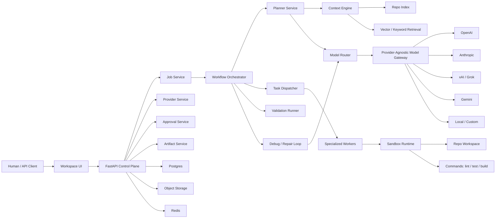
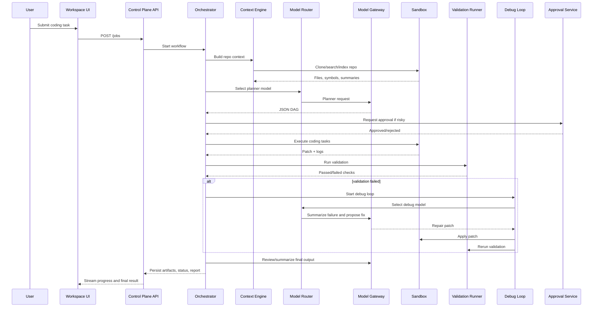
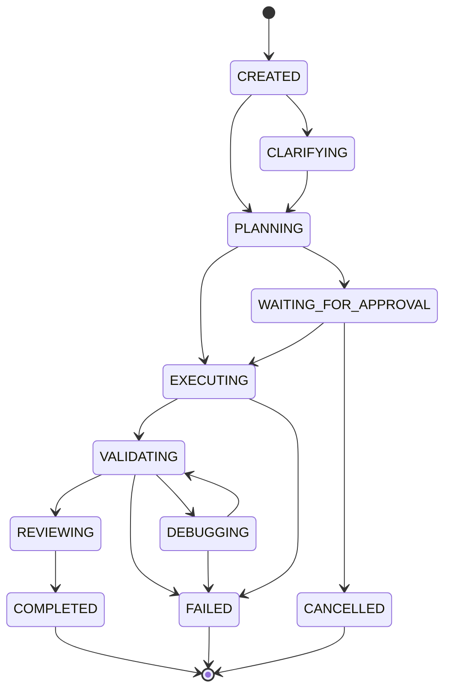
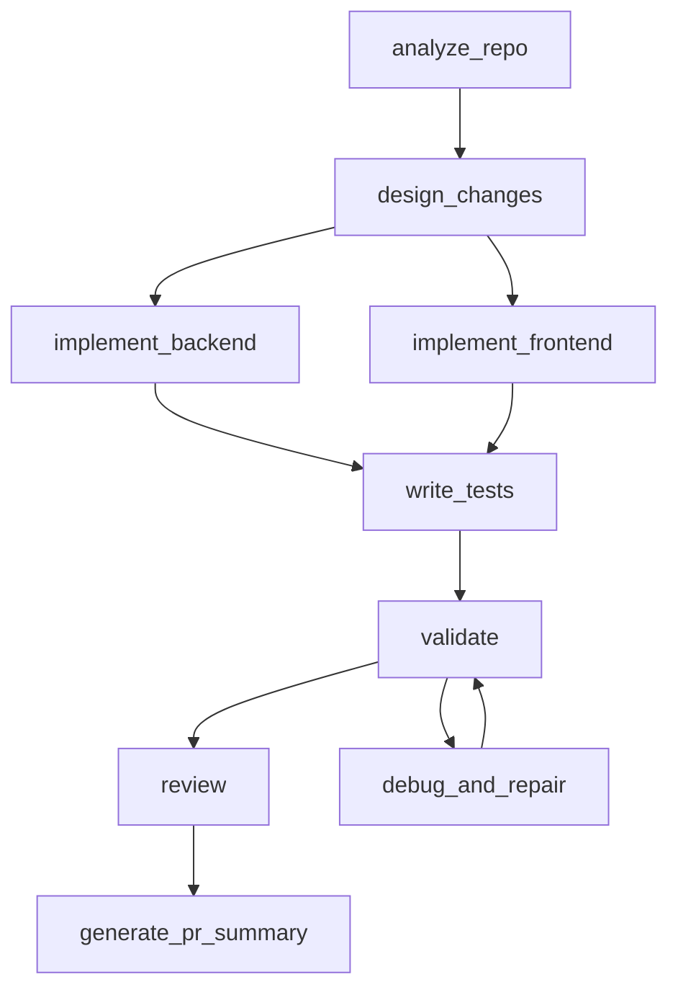

# Atomic Coding Agent End-to-End Architecture

This is the canonical architecture for the platform. It includes the current MVP, the provider-agnostic AI layer, sandbox execution, self-debugging, durable orchestration, persistence, and production hardening.

## Product Goal

Atomic Coding Agent is a provider-agnostic coding agent platform. A user should be able to connect any supported AI provider, submit a coding task against a repository, let the system plan and execute the work in a sandbox, inspect progress, review diffs/artifacts, approve risky actions, and receive a validated result or PR.

Supported provider classes:

- OpenAI / ChatGPT API
- Anthropic / Claude API
- xAI / Grok API
- Google Gemini API
- OpenRouter
- Azure OpenAI, Bedrock, Vertex AI
- Local OpenAI-compatible endpoints such as Ollama, vLLM, LM Studio

## Current Implementation Snapshot

Already implemented:

- FastAPI control plane
- Next.js workspace UI
- Job creation and job details
- Task DAG scaffolding
- Task drawer
- Event stream
- Logs
- Approvals
- Dashboard
- Artifacts
- PR summary artifact
- Diff artifact and diff viewer
- Local sandbox command runner
- Validation rerun endpoint
- Simulated debug repair loop
- AI provider settings UI
- Provider configuration API with masked API key previews

Still architectural placeholders:

- In-memory store instead of database
- Synthetic planner DAG instead of real LLM planner
- Local runner instead of Docker/Kubernetes sandbox
- Simulated debug repair instead of model-generated patch repair
- No real repo clone/indexing yet
- No durable workflow engine yet
- No model gateway calls yet

## System Overview



## Architecture Planes

### 1. Control Plane

The control plane owns platform state, API contracts, user-facing workflow state, approvals, and auditability.

Core responsibilities:

- Auth and workspace access
- Job lifecycle management
- Task state management
- Provider settings
- Approval gates
- Artifacts and logs
- Dashboard metrics
- Usage/cost tracking
- Audit records

Current modules:

- `backend/app/api/routes/jobs.py`
- `backend/app/api/routes/approvals.py`
- `backend/app/api/routes/dashboard.py`
- `backend/app/api/routes/providers.py`
- `backend/app/services/store.py`

Target production modules:

- `job_service.py`
- `task_service.py`
- `approval_service.py`
- `artifact_service.py`
- `provider_service.py`
- `audit_service.py`
- `usage_service.py`

### 2. Intelligence Plane

The intelligence plane owns LLM calls, model routing, planning, review, summarization, debugging, and context construction.

Core responsibilities:

- Convert user request into structured intent
- Ask clarification questions when needed
- Build planner JSON DAG
- Select provider/model per task
- Retrieve repo context
- Generate code patches
- Review changes
- Summarize validation failures
- Generate repair patches

Target modules:

- `model_gateway.py`
- `model_router.py`
- `planner_service.py`
- `context_engine.py`
- `review_service.py`
- `debug_service.py`
- `prompt_registry.py`
- `policy_engine.py`

### 3. Execution Plane

The execution plane owns repo operations, command execution, patch application, and validation.

Current modules:

- `backend/app/services/sandbox.py`
- `backend/app/services/validation_runner.py`

Target modules:

- `repo_worker.py`
- `coding_worker.py`
- `test_worker.py`
- `review_worker.py`
- `sandbox_runner.py`
- `docker_sandbox.py`
- `patch_service.py`
- `command_service.py`

### 4. Data Plane

The data plane owns durable metadata, vector/keyword search, artifacts, and event history.

Target storage:

- Postgres: jobs, tasks, approvals, provider config, model calls, validation runs
- Redis: locks, queues, short-lived status, rate limit counters
- Object storage: diffs, logs, screenshots, test reports, patch bundles
- pgvector/Elasticsearch: repo chunks, docs, symbols, semantic search
- Temporal persistence: durable workflow state and history

## End-to-End Job Flow



## Job State Machine



## Task DAG

Default generated DAG:



Task fields:

- `id`
- `job_id`
- `task_key`
- `task_type`
- `agent_type`
- `status`
- `depends_on`
- `input_json`
- `output_json`
- `error_json`
- `retry_count`
- `started_at`
- `finished_at`

## Provider-Agnostic AI Layer

### Provider Settings

The UI exposes provider configuration at:

- `/settings/providers`

Each provider supports:

- Provider type
- Display name
- API key
- Base URL
- Default model
- Embedding model
- Enable/disable
- Capabilities
- Policy flags
- Max cost per job

Backend API:

- `GET /api/v1/providers`
- `POST /api/v1/providers`
- `GET /api/v1/providers/{provider_id}`
- `PATCH /api/v1/providers/{provider_id}`

### Model Gateway

Target gateway responsibilities:

- Normalize provider calls
- Support streaming
- Normalize tool call formats
- Support JSON schema outputs
- Track tokens, cost, latency
- Apply provider policy
- Redact secrets
- Enforce max cost
- Persist model call audit records
- Support fallback chains

Unified request:

```json
{
  "job_id": "uuid",
  "task_id": "uuid",
  "purpose": "planning",
  "provider_preference": ["openai", "anthropic", "xai"],
  "model_preference": ["gpt-5.1", "claude-sonnet", "grok-code"],
  "messages": [],
  "tools": [],
  "response_format": {
    "type": "json_schema",
    "schema_name": "planner_output_v1"
  },
  "constraints": {
    "max_cost_usd": 1.0,
    "max_latency_ms": 60000,
    "allow_private_repo_code": false
  }
}
```

### Model Router

Routing logic:

- Planning: high-reasoning model
- Repo summarization: fast/cheap long-context model
- Code generation: code-specialized model
- Debug repair: strong tool-use model
- Security review: strict review model
- User preference: preferred provider if policy allows
- Fallback: alternate provider if failure, rate limit, or cost block

## Context Engine

The context engine converts repo state and job history into compact model context.

Inputs:

- User request
- Repo URL/branch
- File tree
- Readme/docs
- Symbol graph
- Dependency graph
- Prior task outputs
- Validation logs
- Approval decisions

Outputs:

- Repo summary
- Relevant files
- Relevant symbols
- Command hints
- Risk flags
- Context package for planner/coder/reviewer/debugger

Target APIs:

- `POST /api/v1/repos/ingest`
- `GET /api/v1/jobs/{job_id}/repo-snapshot`
- `GET /api/v1/jobs/{job_id}/context`
- `POST /api/v1/jobs/{job_id}/context/search`

## Sandbox and Execution

Current implementation:

- Local sandbox runner
- Allowlisted executables: `python`, `node`, `npm`, `npx`
- Captures stdout/stderr/exit code/duration
- Validation rerun endpoint
- Simulated failure and debug recovery path

Target production sandbox:

- Docker container per job
- Optional Kubernetes pod per job
- Firecracker later for stronger isolation
- Read/write repo workspace
- Resource limits
- Network policy
- Secret injection only by explicit policy
- Per-command timeout
- Captured logs and artifacts

Sandbox command schema:

```json
{
  "command": ["npm", "test"],
  "cwd": "repo",
  "timeout_seconds": 120,
  "env": {}
}
```

Command result schema:

```json
{
  "command": ["npm", "test"],
  "cwd": "repo",
  "exit_code": 0,
  "stdout": "...",
  "stderr": "",
  "duration_ms": 1234,
  "timed_out": false
}
```

## Validation and Self-Debugging

Validation runner responsibilities:

- Run configured checks
- Persist each check result
- Store stdout/stderr
- Mark job failed or passed
- Trigger debug loop when configured

Debug loop:

1. Collect failed validation checks.
2. Summarize error output.
3. Retrieve relevant files.
4. Ask debug model for root cause and patch.
5. Apply patch only if policy allows.
6. Re-run validation.
7. Repeat until max retries.
8. Escalate to human if unresolved.

Current API:

- `POST /api/v1/jobs/{job_id}/validation/rerun`

Current UI:

- Validation tab
- Run validation
- Simulate failure + debug
- Display exit code, duration, output summary

## Approval and Policy Gates

Approval required for:

- Auth/security changes
- Billing/payment changes
- DB migrations
- Infra/deployment changes
- File deletes
- Large refactors
- Secret access
- Private repo code sent to external provider when policy disallows it
- Exceeding cost budget

Policy engine checks:

- Provider policy
- Job policy
- Tool permissions
- Sandbox command allowlist
- Cost budget
- Data sensitivity
- Approval requirements

## Data Model Target

Core tables:

- `users`
- `organizations`
- `projects`
- `provider_configs`
- `provider_secrets`
- `jobs`
- `tasks`
- `task_dependencies`
- `repo_snapshots`
- `repo_files`
- `repo_symbols`
- `model_calls`
- `tool_calls`
- `validation_runs`
- `validation_checks`
- `approvals`
- `artifacts`
- `execution_logs`
- `audit_events`
- `usage_events`

## API Surface

Current:

- `POST /api/v1/jobs`
- `GET /api/v1/jobs`
- `GET /api/v1/jobs/{job_id}`
- `GET /api/v1/jobs/{job_id}/status`
- `GET /api/v1/jobs/{job_id}/tasks`
- `GET /api/v1/jobs/{job_id}/tasks/{task_id}`
- `GET /api/v1/jobs/{job_id}/events`
- `GET /api/v1/jobs/{job_id}/events/stream`
- `GET /api/v1/jobs/{job_id}/logs`
- `GET /api/v1/jobs/{job_id}/artifacts`
- `GET /api/v1/jobs/{job_id}/artifacts/{artifact_id}/content`
- `GET /api/v1/jobs/{job_id}/validation`
- `POST /api/v1/jobs/{job_id}/validation/rerun`
- `GET /api/v1/jobs/{job_id}/approvals`
- `GET /api/v1/approvals`
- `GET /api/v1/approvals/{approval_id}`
- `POST /api/v1/approvals/{approval_id}/approve`
- `POST /api/v1/approvals/{approval_id}/reject`
- `GET /api/v1/dashboard/summary`
- `GET /api/v1/providers`
- `POST /api/v1/providers`
- `GET /api/v1/providers/{provider_id}`
- `PATCH /api/v1/providers/{provider_id}`

Target additions:

- `POST /api/v1/model-calls`
- `GET /api/v1/jobs/{job_id}/model-calls`
- `POST /api/v1/jobs/{job_id}/plan`
- `POST /api/v1/jobs/{job_id}/repo/ingest`
- `GET /api/v1/jobs/{job_id}/repo-snapshot`
- `POST /api/v1/jobs/{job_id}/patches/apply`
- `POST /api/v1/jobs/{job_id}/commands/run`
- `POST /api/v1/jobs/{job_id}/debug`
- `POST /api/v1/jobs/{job_id}/pr`

## Frontend Information Architecture

Current shell:

- Left workspace/project sidebar
- Top job/action bar
- Center work surface
- Right progress/artifact rail
- Bottom follow-up composer

Current pages:

- `/jobs`
- `/jobs/{job_id}`
- `/new`
- `/approvals`
- `/approvals/{approval_id}`
- `/dashboard`
- `/settings/providers`

Target pages:

- `/settings/models`
- `/settings/policies`
- `/jobs/{job_id}/model-calls`
- `/jobs/{job_id}/repo`
- `/jobs/{job_id}/diff`
- `/jobs/{job_id}/sandbox`
- `/jobs/{job_id}/cost`

## Observability

Required metrics:

- Job duration
- Task duration
- Validation duration
- Debug retry count
- Model latency
- Model token usage
- Model cost
- Sandbox command failures
- Approval wait time
- Provider error rates

Required logs:

- Job events
- Task events
- Model calls
- Tool calls
- Sandbox commands
- Validation output
- Approval decisions
- Policy blocks
- Artifact creation

## Security Model

Rules:

- Never return plaintext provider API keys.
- Encrypt provider secrets at rest.
- Redact secrets from logs and model prompts.
- Do not send private repo code to providers unless allowed.
- Require approval for high-risk code changes.
- Restrict sandbox commands.
- Restrict network by default in production sandbox.
- Use short-lived job workspaces.
- Clean up job workspaces after retention period.
- Keep immutable audit records.

## Implementation Roadmap

### Phase 1: Stabilize Current MVP

1. Split in-memory store into service interfaces.
2. Add typed repository interfaces.
3. Add error schemas.
4. Add pagination for jobs/logs/artifacts.
5. Add frontend empty/error states.

### Phase 2: Provider-Agnostic Model Gateway

1. Add `model_gateway.py`.
2. Add provider adapter interface.
3. Implement OpenAI-compatible adapter.
4. Implement Anthropic adapter.
5. Implement xAI/Grok adapter.
6. Add model call audit records.
7. Add provider policy enforcement.
8. Add model calls tab in job detail.

### Phase 3: Planner and Context

1. Add planner JSON schema.
2. Add planner service.
3. Add repo ingestion service.
4. Clone repo into job workspace.
5. Build file tree.
6. Detect stack and commands.
7. Build repo summary.
8. Replace synthetic DAG with model-generated DAG.

### Phase 4: Real Sandbox Execution

1. Add workspace manager.
2. Add patch apply service.
3. Replace static worker outputs with real file edits.
4. Add Docker sandbox runner.
5. Add command preset detection.
6. Add validation from repo-specific commands.

### Phase 5: Real Debug and Repair

1. Add failure summarizer.
2. Add debug model call.
3. Add patch proposal artifact.
4. Add approval gate before applying risky repair.
5. Apply repair patch.
6. Rerun validation.
7. Enforce max retries.

### Phase 6: Persistence

1. Add Postgres.
2. Add SQLAlchemy models.
3. Add Alembic migrations.
4. Store jobs/tasks/approvals/artifacts/logs/providers.
5. Add encrypted secret storage.
6. Add object storage abstraction.

### Phase 7: Durable Orchestration

1. Add Temporal.
2. Move job workflow into Temporal workflow.
3. Move repo ingestion/planning/execution/validation into activities.
4. Add approval signals.
5. Add cancellation.
6. Add retry policies.
7. Add workflow recovery.

### Phase 8: GitHub Integration

1. Add GitHub app/OAuth.
2. Clone private repos.
3. Create branches.
4. Push patch branches.
5. Create PRs.
6. Sync PR comments and review feedback.

### Phase 9: Production Hardening

1. Multi-tenant auth.
2. Rate limits.
3. Cost limits.
4. Audit export.
5. Workspace cleanup.
6. Provider health checks.
7. Benchmark suite.
8. Deployment pipeline.

## Near-Term Task Order

Recommended exact next tasks:

1. Add model call schemas.
2. Add model gateway service interface.
3. Add OpenAI-compatible adapter using configured provider base URL.
4. Add model router with rule-based routing.
5. Add model call audit endpoint.
6. Add model calls UI tab.
7. Add planner output schema.
8. Add planner service that calls model gateway.
9. Replace `default_plan()` with provider-backed planning.
10. Add repo ingestion workspace folder.
11. Add file tree scanner.
12. Add stack/command detector.
13. Add Docker sandbox runner.
14. Add patch apply service.
15. Add real debug patch proposal flow.

