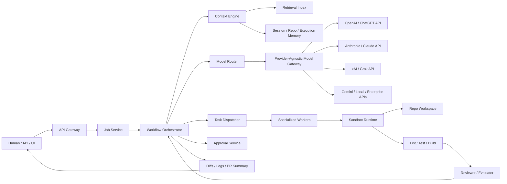
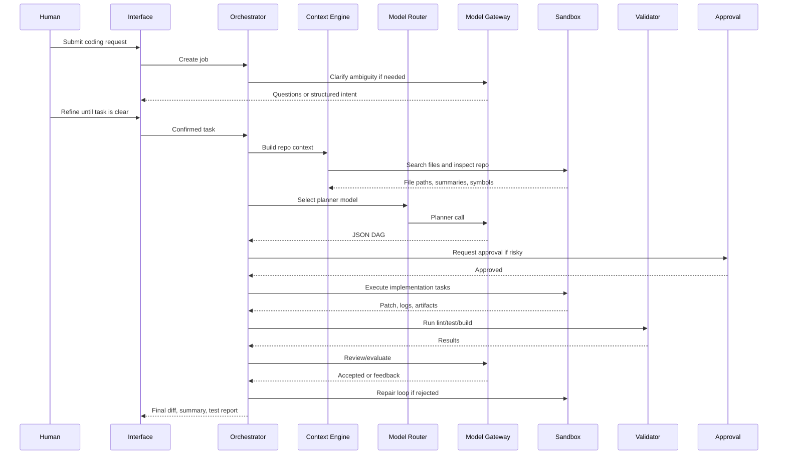
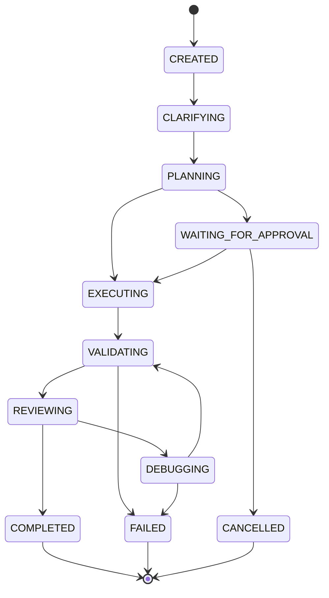

# Revised Provider-Agnostic Coding Agent Design

This design combines the workflow patterns from the reference diagrams:

- Augmented LLM: model plus retrieval, tools, and memory.
- Prompt chaining: staged calls with gates.
- Routing: pick the right model, agent, or workflow branch.
- Parallelization: run independent specialist calls together.
- Orchestrator-workers: central workflow control with specialist executors.
- Evaluator-optimizer: generate, evaluate, repair, repeat.
- Autonomous agent: act in an environment with feedback and stop conditions.
- Coding agent flow: clarify, gather context, write code, test, display results.

The key change is that the platform should not be tied to one model vendor. Users can connect OpenAI, Anthropic, xAI/Grok, Google, local models, or enterprise model endpoints through a single model gateway.

## One-Line Architecture

Use a durable workflow engine to orchestrate coding jobs, a provider-agnostic model gateway to call any LLM API, sandboxed workers to act on code, retrieval and memory to manage context, and validation gates to decide whether work can continue.

## High-Level System



## Core Planes

### 1. Control Plane

Owns product and workflow state.

Responsibilities:

- Authentication and org/project access.
- Job creation and job history.
- Workflow state transitions.
- Human approvals.
- Audit logs.
- Billing, quotas, usage, and cost controls.
- Provider key management.

Services:

- API Gateway
- Job Service
- Approval Service
- Audit Service
- Usage/Billing Service
- Provider Credential Service

### 2. Intelligence Plane

Owns reasoning, planning, routing, retrieval, and review.

Responsibilities:

- Normalize user intent.
- Clarify ambiguous tasks.
- Build a task DAG.
- Retrieve repo context.
- Choose provider/model per task.
- Summarize tool output.
- Evaluate generated code.
- Optimize failed attempts.

Services:

- Planner Agent
- Model Router
- Provider-Agnostic Model Gateway
- Context Engine
- Reviewer Agent
- Debug Agent
- Prompt/Policy Registry

### 3. Execution Plane

Owns real code actions.

Responsibilities:

- Clone or mount repos.
- Search files.
- Apply patches.
- Run commands.
- Execute tests/build/lint.
- Capture stdout/stderr.
- Enforce resource limits.

Services:

- Task Dispatcher
- Repo Worker
- Backend Worker
- Frontend Worker
- Test Worker
- Review Worker
- Sandbox Runtime
- Artifact Service

### 4. Data Plane

Owns durable state and retrieval data.

Responsibilities:

- Job/task metadata.
- Repo snapshots.
- File summaries.
- Symbol index.
- Embeddings.
- Logs and artifacts.
- Model usage and cost events.

Recommended stack:

- Postgres for durable source of truth.
- Redis for fast coordination and cache.
- pgvector or Elasticsearch for retrieval.
- S3-compatible object storage for artifacts.
- Temporal persistence for workflow history.

## Provider-Agnostic Model Layer

Users should be able to bring any model API.

Supported provider types:

- OpenAI: GPT models, embeddings, tool calling.
- Anthropic: Claude models.
- xAI: Grok models.
- Google: Gemini models.
- OpenRouter or LiteLLM-style aggregators.
- Local models: Ollama, vLLM, LM Studio, self-hosted endpoints.
- Enterprise gateways: Azure OpenAI, Bedrock, Vertex AI.

### Model Gateway Responsibilities

The app should never call provider SDKs directly from agents. All calls go through the gateway.

Responsibilities:

- Normalize provider request/response shapes.
- Handle streaming.
- Handle tool-call formats.
- Track tokens, latency, cost, retries, and errors.
- Enforce policy: allowed providers, max cost, region, data retention.
- Support fallback chains.
- Redact secrets before provider calls.
- Persist model call records for audit.

### Unified Model Request

```json
{
  "model_request_id": "uuid",
  "job_id": "uuid",
  "task_id": "uuid",
  "purpose": "planning | coding | review | debug | summarize",
  "provider_preference": ["openai", "anthropic", "xai"],
  "model_preference": ["gpt-5.1", "claude-sonnet", "grok-code"],
  "messages": [],
  "tools": [],
  "response_format": {
    "type": "json_schema",
    "schema_name": "planner_output_v1"
  },
  "constraints": {
    "max_cost_usd": 0.5,
    "max_latency_ms": 60000,
    "allow_training": false,
    "data_region": "auto"
  }
}
```

### Model Router

Routing picks the best provider/model for a task.

Example routing rules:

- Planning: strongest reasoning model.
- Repo summarization: cheaper fast model.
- Code generation: coding-optimized model.
- Review/security: high precision model.
- Debug loop: model with strong tool-use and error reasoning.
- User-owned key: prefer user provider unless policy blocks it.

Routing inputs:

- Task type.
- Required context length.
- Cost budget.
- Latency target.
- Provider availability.
- User preference.
- Privacy policy.
- Historical success rate.

## Revised Coding Workflow



## Workflow Pattern Mapping

### Augmented LLM

Every agent call receives:

- Retrieved repo context.
- Session memory.
- Relevant logs.
- Tool descriptions.
- Policy constraints.
- Expected JSON output schema.

### Prompt Chaining

Use chains for sequential reasoning:

1. Understand request.
2. Summarize repo.
3. Produce plan.
4. Design changes.
5. Generate code.
6. Review.
7. Summarize output.

Each step has a gate.

### Routing

Use routing for:

- Provider/model selection.
- Agent selection.
- Task path selection.
- Approval path selection.
- Debug strategy selection.

### Parallelization

Run independent work in parallel:

- Backend implementation.
- Frontend implementation.
- Test generation.
- Documentation update.
- Static review.

Merge via an aggregator.

### Orchestrator-Workers

Temporal or another workflow engine owns:

- Dependencies.
- Retries.
- Timeouts.
- Human waits.
- Resume after crash.
- Long-running jobs.

Workers only do focused tasks.

### Evaluator-Optimizer

Use this for validation and repair:

1. Generate patch.
2. Run tests.
3. Review code.
4. If rejected, produce targeted feedback.
5. Retry with bounded attempts.
6. Escalate to human if still failing.

### Autonomous Agent

Autonomy should be bounded.

The agent may:

- Search files.
- Read code.
- Propose edits.
- Apply non-risky patches.
- Run tests.

The agent must stop for:

- Secrets.
- Billing logic.
- Auth/security changes.
- DB migrations.
- File deletes.
- Production deployment.
- Budget exhaustion.

## Job State Machine



## Recommended MVP v2 Build Order

1. Add provider-agnostic model gateway.
2. Add provider credential storage and user model preferences.
3. Add model router with simple rules.
4. Add planner output schema and validation.
5. Replace synthetic DAG generation with real planner call.
6. Add repo ingestion and context retrieval.
7. Add sandbox command runner.
8. Add evaluator-optimizer repair loop.
9. Add Temporal durable workflows.
10. Replace in-memory store with Postgres.

## Updated Backend Modules

Suggested structure:

```text
backend/app/
  api/routes/
    jobs.py
    approvals.py
    dashboard.py
    providers.py
    model_calls.py
    repo_context.py
  models/
    enums.py
  schemas/
    providers.py
    model_gateway.py
    planner.py
    tasks.py
    jobs.py
  services/
    model_gateway.py
    model_router.py
    provider_registry.py
    planner_service.py
    context_engine.py
    policy_engine.py
    orchestrator.py
    store.py
  workers/
    repo_worker.py
    coding_worker.py
    validation_worker.py
    review_worker.py
```

## Provider API UX

Users should be able to configure:

- Provider name.
- API key.
- Base URL.
- Default model.
- Embedding model.
- Max cost per job.
- Whether provider can receive repo code.
- Whether provider can be used for security-sensitive tasks.

Frontend screens:

- Settings -> Providers.
- Job create -> model preference.
- Job detail -> model calls tab.
- Dashboard -> usage/cost cards.

## Policy Rules

Before every model or tool call, run policy checks.

Examples:

- Do not send secrets to external providers.
- Do not use non-approved providers for private repos.
- Do not exceed user budget.
- Do not auto-apply destructive file operations.
- Require approval for auth, billing, migration, infra, delete operations.

## What Changes From Current Repo

Current repo already has:

- Job API.
- Task API.
- Approval API.
- Dashboard.
- Artifacts.
- Diff viewer.
- Task drawer.

Next architectural upgrades:

- Add provider settings and model gateway.
- Add model call audit records.
- Add model router.
- Add planner schema.
- Replace synthetic task generation with real provider-backed planning.

